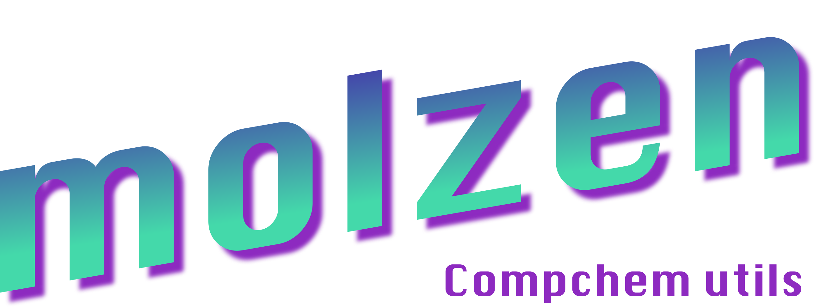

<p align="center">
  
</p>

<p align="center">
  
</p>

# molzen

Python utilities for computational chemistry: read and write molecular structures,
work with trajectories, parse ORCA and TeraChem outputs, and visualize molecules.

## Setup

Requires Python 3.11+ and `uv`. CI uses Python 3.13.

```bash
git clone git@github.com:davidcjuergens/molzen.git
cd molzen
uv sync --frozen
```

Run Python scripts with `uv run python script.py`, or start an interactive session
with `uv run python`. These commands use the project's environment and dependencies.

## Quick start

Create a molecule and save it as XYZ:

```python
import numpy as np
from molzen.io import Molecule

water = Molecule(
    elements=["O", "H", "H"],
    xyz=np.array([
        [0.000, 0.000, 0.000],
        [0.758, 0.000, 0.504],
        [-0.758, 0.000, 0.504],
    ]),
)
water.to_xyz("water.xyz")

mol = Molecule.from_xyz("water.xyz")
print(mol.elements)   # ["O", "H", "H"]
print(mol.xyz.shape)  # (3, 3)
```

`mol.xyz` has shape `(n_atoms, 3)` for a single frame and
`(n_frames, n_atoms, 3)` for multiple frames.

Load other structures or calculation outputs with the corresponding reader:

```python
protein = Molecule.from_pdb("protein.pdb")
orca = Molecule.from_orca_stdout("orca.out")
terachem = Molecule.from_terachem_stdout("terachem.out")
```

TeraChem output loading may also require the coordinate or trajectory files
referenced by the calculation, so keep its input and scratch files accessible.

In a Jupyter notebook using the project environment, display an interactive
py3Dmol view with:

```python
mol.show()
```
